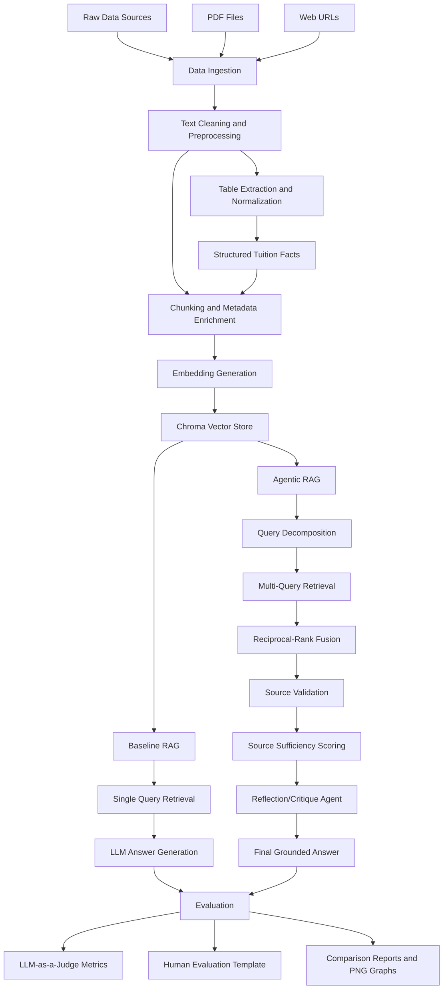

# KazNU Agentic RAG Assistant

This repository contains the implementation of an **Agentic Retrieval-Augmented Generation (RAG)** system for university information assistance at **Al-Farabi Kazakh National University**.

The project was developed for the dissertation topic:

> **Agentic AI for Unstructured Data Processing with Retrieval-Augmented Generation (RAG)**

The system processes university-related PDFs and web pages, builds a vector database, compares a **Baseline RAG** pipeline with an **Agentic RAG** pipeline, and evaluates the systems using automatic and human-evaluation methods.

## Project Objective

The objective of this project is to build a university information assistant that can answer student and applicant questions using verified institutional sources.

The system is designed to:

- retrieve information from PDFs and web pages,
- answer questions using grounded context,
- reduce hallucination,
- handle complex and multi-constraint queries,
- support query decomposition and multi-query retrieval,
- validate retrieved sources,
- detect insufficient evidence,
- compare Baseline RAG and Agentic RAG performance.

## Project Scope

The current implementation focuses on English-language university information sources, including:

- admissions information,
- tuition fees,
- academic policy,
- AI regulation,
- foreign student procedures,
- medical/visa-related information,
- university booklet and institutional information.

The system is modular and can be extended later with additional PDFs, URLs, Kazakh/Russian multilingual support, and a frontend interface.

## System Architecture

## Main components

- PDF and web data ingestion
- Text cleaning and preprocessing
- Table extraction and tuition-fee normalization
- Chunking and metadata enrichment
- Chroma vector store creation
- Baseline RAG question answering
- Agentic RAG with:
  - query decomposition
  - multi-query retrieval
  - reciprocal-rank fusion
  - source validation
  - source sufficiency scoring
  - reflection agent
- LLM-as-a-judge evaluation
- Baseline vs Agentic RAG comparison
- Evaluation graphs for thesis and presentation

## Project Structure

kaznu-agentic-rag-assistant/
│
├── config/
│   └── settings.yaml
│
├── data/
│   ├── raw/
│   ├── interim/
│   ├── processed/
│   └── vectorstore/
│
├── evaluation/
│   ├── baseline_test_questions.json
│   ├── agentic_complex_questions.json
│   └── complex_questions_30.json
│
├── outputs/
│   ├── baseline_rag/
│   ├── agentic_rag/
│   └── evaluation/
│
├── src/
│   └── kaznu_rag/
│       ├── ingest/
│       ├── preprocess/
│       ├── chunking/
│       ├── rag/
│       ├── agentic/
│       └── evaluation/
│
├── tests/
├── requirements.txt
├── pyproject.toml
├── .env.example
├── .gitignore
└── README.md

## Experimental status

The stable Qwen/KazNU-based experiment includes:

- Baseline RAG on 30 complex queries
- Agentic RAG on the same 30 complex queries
- Evaluation metrics: faithfulness, relevance, completeness, citation quality, hallucination score, and latency
- PNG plots for presentation

## Evaluation design

The project uses two evaluation settings:

1. **General Baseline RAG evaluation**
   - Baseline RAG was evaluated on 50 dataset-aligned university information questions.
   - This setting measures the performance of a standard RAG pipeline on direct university information queries.

2. **Controlled complex-query comparison**
   - Baseline RAG and Agentic RAG were both evaluated on the same 30 complex multi-part questions.
   - This setting measures behavior on multi-source, ambiguous, missing-information, noisy-retrieval, tuition, admissions, academic-policy, AI-policy, and mixed-policy questions.

The experimental interpretation is that Baseline RAG is efficient and strong for direct questions, while Agentic RAG provides additional transparency and control for complex questions through query decomposition, multi-query retrieval, source validation, source sufficiency scoring, reflection, and rejected-source tracking.

## Adaptive routing

The system also includes an adaptive RAG mode:

- Simple single-intent questions are routed to Baseline RAG.
- Complex, multi-source, ambiguous, or missing-information questions are routed to Agentic RAG.

This design avoids unnecessary agentic overhead for simple questions while preserving the benefits of query decomposition, source validation, source sufficiency scoring, and reflection for complex queries.

## Human evaluation

The project includes a human evaluation template for comparing Baseline RAG and Agentic RAG outputs on the same 30 complex questions. Reviewers can rate each answer using:

- correctness
- completeness
- clarity
- usefulness
- trustworthiness
- source transparency
- observed hallucination

This provides a small human-evaluation layer in addition to LLM-as-a-judge automatic evaluation.

### Main finding

The Baseline RAG system performed strongly on direct and dataset-aligned questions. The Agentic RAG system provided additional transparency and control for complex questions by using:

- query decomposition
- multi-query retrieval
- source validation
- source sufficiency scoring
- reflection/critique
- rejected-source tracking

The Agentic RAG workflow improves explainability and hallucination control, but introduces additional latency due to extra reasoning and validation steps.

## Security note

API keys are loaded from `.env`, which is intentionally excluded from Git tracking.
Use `.env.example` as a template.
